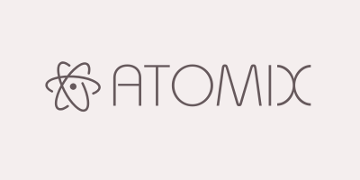

# 

**Atomix** is a minimal smart contract library focused on providing the _bare minimum_ implementations of popular Ethereum standards.  
No extra features, no unnecessary complexity — just the pure essentials.

## 📦 Contracts

```ml
auth
├─ Ownable — "Ownable contract with single owner authorization."
tokens
├─ ERC20 - "Minimal ERC20 implementation compliant with ERC-20 Token Standard."
├─ ERC721 - "Minimal ERC721 implementation compliant with Non-Fungible Token Standard."
├─ WETH - "Minimal WETH implementation."
```

_(More coming soon.)_

## 🚀 Installation

To install with [**Foundry**](https://github.com/foundry-rs/foundry):

```bash
forge install gopiinho/atomix
```

or clone manually:

```bash
git clone https://github.com/gopiinho/atomix.git
```

## 📜 License

MIT License.
Free to use, modify, and build on.
